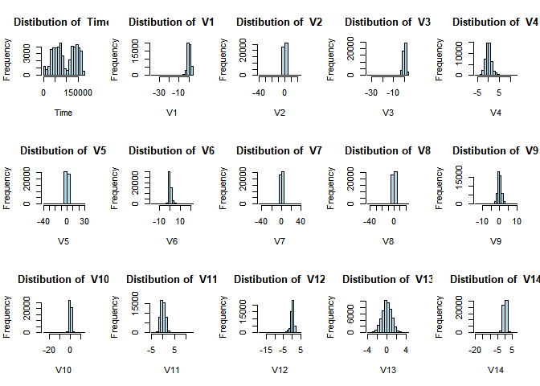
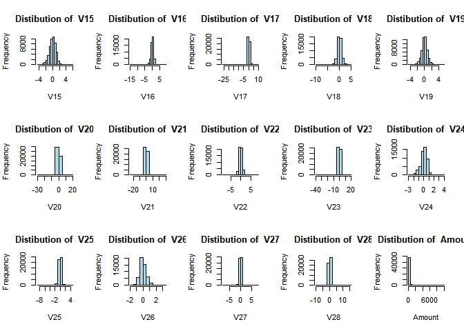
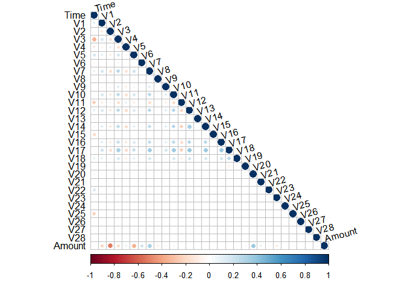
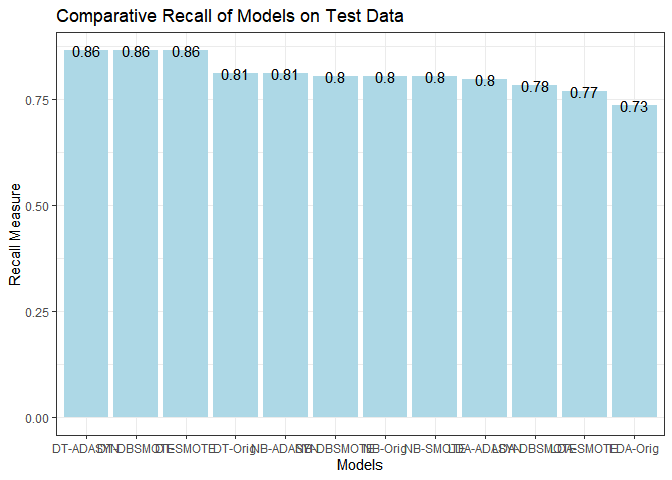
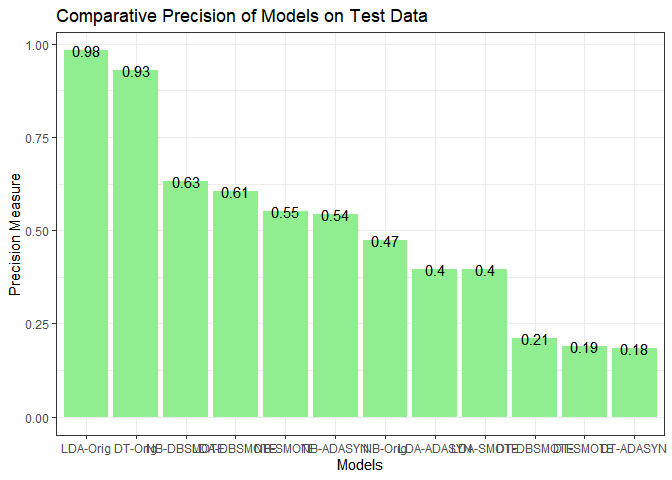
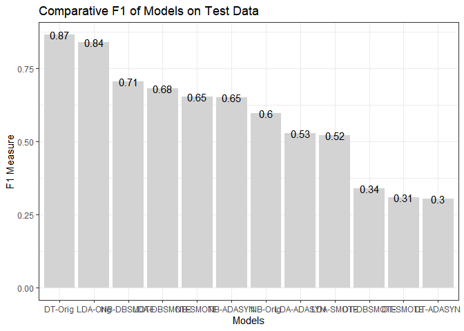

<style>body{text-align: justify;
           font-family: Garamond Premier Pro;
           font-size: 12pt;
           font-style: inherit;}
</style>
           
## 1. Project Objective

* The objective of this project is to predict which credit card transactions in the dataset are fraudulent using three
classification algorithms and three synthetic balancing techniques. The three classifier algorithms we will train include:
  + Decision Tree, which uses a tree-like model of decisions to arrive at a classification prediction.
  + Naive Bayes, which uses Bayes' theorem to use probability to arrive at a classification prediction.
  + Linear Discriminant Analysis, which finds a linear combination of features that is then used to separate the classes and
  arrive at a classification prediction.

* Given that the objective is to evaluate the model performance of the three classifier algorithms and synthetic balancing 
techniques, we will not be thoroughly reviewing the model output, but rather will be focusing on the classification performance
results.

* Lets start by loading the R library packages that will be used in this project, which are the caret, corrplot, and smote-family
packages.


```r
#Load the packages used in the project
suppressPackageStartupMessages(c(library(caret),library(corrplot),library(smotefamily)))
```

### 1.1 Import the dataset

Next, using the "read.csv" function, we will import the credit card fraud dataset and set the class to a factor. This dataset is a
subset of the dataset from sourced from https://www.kaggle.com/mlg-ulb/creditcardfraud, which includes anonymized credit card
transactions.


```r
#A. Load the dataset (a proportion of the original data)
creditcardFraud <- read.csv("creditcardFraud.csv")
#B. Change class to factor the as.factor function encodes the vector as a factor or category
creditcardFraud$class <- as.factor(creditcardFraud$class)
```

## 2. Explore The Data

* Now that we have downloaded the data we can start the training of the models, but it is important that we first understand and
explore our data as it helps us identify potential data quality issues and it provides us the needed context to develop an
appropriate model.  

* In this project, we will briefly explore the data and perform a high-level exploratory data analysis (EDA) of the dataset

### 2.1 EDA {.tabset}

#### A. Structure


```r
str(creditcardFraud)
```

```
'data.frame':	49692 obs. of  31 variables:
 $ Time  : int  406 472 4462 6986 7519 7526 7535 7543 7551 7610 ...
 $ V1    : num  -2.31 -3.04 -2.3 -4.4 1.23 ...
 $ V2    : num  1.95 -3.16 1.76 1.36 3.02 ...
 $ V3    : num  -1.61 1.09 -0.36 -2.59 -4.3 ...
 $ V4    : num  4 2.29 2.33 2.68 4.73 ...
 $ V5    : num  -0.522 1.36 -0.822 -1.128 3.624 ...
 $ V6    : num  -1.4265 -1.0648 -0.0758 -1.7065 -1.3577 ...
 $ V7    : num  -2.537 0.326 0.562 -3.496 1.713 ...
 $ V8    : num  1.3917 -0.0678 -0.3991 -0.2488 -0.4964 ...
 $ V9    : num  -2.77 -0.271 -0.238 -0.248 -1.283 ...
 $ V10   : num  -2.772 -0.839 -1.525 -4.802 -2.447 ...
 $ V11   : num  3.202 -0.415 2.033 4.896 2.101 ...
 $ V12   : num  -2.9 -0.503 -6.56 -10.913 -4.61 ...
 $ V13   : num  -0.5952 0.6765 0.0229 0.1844 1.4644 ...
 $ V14   : num  -4.29 -1.69 -1.47 -6.77 -6.08 ...
 $ V15   : num  0.38972 2.00063 -0.69883 -0.00733 -0.33924 ...
 $ V16   : num  -1.141 0.667 -2.282 -7.358 2.582 ...
 $ V17   : num  -2.83 0.6 -4.78 -12.6 6.74 ...
 $ V18   : num  -0.0168 1.7253 -2.6157 -5.1315 3.0425 ...
 $ V19   : num  0.417 0.283 -1.334 0.308 -2.722 ...
 $ V20   : num  0.12691 2.10234 -0.43002 -0.17161 0.00906 ...
 $ V21   : num  0.517 0.662 -0.294 0.574 -0.379 ...
 $ V22   : num  -0.035 0.435 -0.932 0.177 -0.704 ...
 $ V23   : num  -0.465 1.376 0.173 -0.436 -0.657 ...
 $ V24   : num  0.3202 -0.2938 -0.0873 -0.0535 -1.6327 ...
 $ V25   : num  0.0445 0.2798 -0.1561 0.2524 1.4889 ...
 $ V26   : num  0.178 -0.145 -0.543 -0.657 0.567 ...
 $ V27   : num  0.2611 -0.2528 0.0396 -0.8271 -0.01 ...
 $ V28   : num  -0.1433 0.0358 -0.153 0.8496 0.1468 ...
 $ Amount: num  0 529 240 59 1 ...
 $ class : Factor w/ 2 levels "no","yes": 2 2 2 2 2 2 2 2 2 2 ...
```

#### B. Missing data?


```r
sum(is.na(creditcardFraud))
```

```
[1] 0
```

#### C. Check the imbalance in the dataset


```r
summary(creditcardFraud$class)
```

```
   no   yes 
49200   492 
```

#### D. Proportions table


```r
prop.table(table(creditcardFraud$class))
```

```

        no        yes 
0.99009901 0.00990099 
```

#### E. Compile histograms for each variable


```r
par(mfrow = c(3,5))
i <- 1
for (i in 1:30) {
  hist((creditcardFraud[,i]), main = paste("Distibution of ", 
       colnames(creditcardFraud[i])), 
       xlab = colnames(creditcardFraud[i]),
       col = "light blue")
  }
```

<!-- --><!-- -->

#### E. Compute the correlations among the variables


```r
r <- cor(creditcardFraud[,1:30])
corrplot(r, type = "lower", tl.col = 'black',  tl.srt = 15)
```

<!-- -->

## 3. Split the Data into Training and Test Sets

It is important that when we evaluate the performance of a model, we do so on a dataset that the model has not previously seen.
Therefore, we will split our dataset into a training dataset and a test dataset and to maintain the same level of imbalance as
in the original dataset, we will use stratified sampling by "class."

* Training Dataset: This is the random subset of your data used to initially fit (or train) your model.

* Test Dataset: This dataset used to provide an unbiased evaluation of the model fit on the training dataset.

### 3.1 Train/Test {.tabset}

#### A. Split data into training and testing dataset used for model building (training dataset)


```r
set.seed(1337)
train <- createDataPartition(creditcardFraud$class,
                             p = 0.7, # % of data going to training
                             times = 1,
                             list = F)
train.orig <- creditcardFraud[ train,]
test       <- creditcardFraud[-train,]
```

#### B. Check the proportion of observations allocated to each group


```r
dim(train.orig) / dim(creditcardFraud) ## result row percentage in original train set - column ratio
```

```
[1] 0.7000121 1.0000000
```

#### C. Class balance for training dataset


```r
prop.table(table(train.orig$class))
```

```

         no         yes 
0.990081932 0.009918068 
```

#### D. Class balance for test dataset


```r
prop.table(table(test$class))
```

```

         no         yes 
0.990138861 0.009861139 
```

## 4. Compile Synthetically Balanced Training Datsets

Now that we have split our dataset into a training and test dataset, lets create three new synthetically balanced
datasets from the one imbalanced training dataset. To do this we will be using the "smotefamily" R package and we
will be trying out three different techniques: SMOTE, ADASYN, and DB-SMOTE. Below is a brief description of each:

* SMOTE (Synthetic Minority Oversampling Technique): A subset of data is taken from the minority class as an example.
New synthetic similar examples are generated from the “feature space” rather than the “data space.”

* ADASYN (Adaptive Synthetic Sampling): A weighted distribution is used depending on each minority class according to
their degree of learning difficulty. More synthetic observations are generated for some minority class instances that
are more difficult to learn as compared to others 

* DB-SMOTE (Density Based SMOTE): This over-samples the minority class at the decision boundary and over-examines the
region to maintain the majority class detection rate. These are more likely to be misclassified than those far from the
border.


```r
#SMOTE Balanced

train.smote <- SMOTE(train.orig[,-31],train.orig$class,K = 5)
train.smote <- train.smote$data # extract only the balanced dataset
train.smote$class <- as.factor(train.smote$class)

#ADASYN Balanced

train.adas <- ADAS(train.orig[,-31],train.orig$class,K = 5)
train.adas <- train.adas$data  # extract only the balanced dataset
train.adas$class <- as.factor(train.adas$class)

#Density based SMOTE

train.dbsmote <- DBSMOTE(train.orig[,-31],train.orig$class)
train.dbsmote <- train.dbsmote$data # extract only the balanced dataset
train.dbsmote$class <- as.factor(train.dbsmote$class)
```

## 5. Evaluate Class distributions for Synthetic datasets {.tabset}

### A. Class Distribution of SMOTE Balanced Dataset


```r
prop.table(table(train.smote$class))
```

```

       no       yes 
0.5020774 0.4979226 
```

### B. Class Distribution of ADASYN Balanced Dataset


```r
prop.table(table(train.adas$class))
```

```

       no       yes 
0.4993041 0.5006959 
```

### C. Class Distribution of DB SMOTE Balanced Dataset


```r
prop.table(table(train.dbsmote$class))
```

```

       no       yes 
0.5184483 0.4815517 
```

## 6. Original Data: Train Decision Tree, Naive Bayes, and LDA Models

Now that we have our four training datasets; 

1. the original imbalanced training dataset, 

2. the SMOTE balanced training dataset, 

3. the ADASYN balanced training dataset, and 

4. the DB-SMOTE balanced training dataset, 

We will use the 'caret' package to train three classifier models (decision tree, naive Bayes, linear discriminant analysis).
Lets start by fitting the three classifier models using the original imbalanced training dataset.  We will use repeated 10x
cross validation for our models across all of our trained models.


```r
#A. Global options that we will use across all of our trained models

ctrl <- trainControl(method = 'cv',
                     number = 10,
                     classProbs = TRUE,
                     summaryFunction = twoClassSummary)

#B. Decision Tree: original data

dt_orig <- train(class ~ .,
                 data = train.orig,
                 method = "rpart",
                 trControl = ctrl,
                 metric = "ROC")

#C. Naive Bayes regression: original data

nb_orig <- train(class ~ .,
                 data = train.orig,
                 method = "naive_bayes",
                 trControl = ctrl,
                 metric = "ROC")

#D. Linear Discriminant Analysis: original data

lda_orig <- train(class ~ .,
                 data = train.orig,
                 method = "lda",
                 trControl = ctrl,
                 metric = "ROC")
```

### 6.1 Compile Classifications on Test Data using models trained on the original imbalanced training dataset

Next, we will use the models we have trained using the original imbalanced training dataset
to generate predictions on the test dataset. 

* We will then compile three measures of performance, which we will use to compare the performance
of the models across all of our trained models: 
  + Precision = TP / (TP + FP) - measures proportion of positive cases that are truly positive
  + Recall = TP / (TP + FN) - measures how complete the results are. This is often also called the senSitivity
  + F1 measure = (2 x Precision * Recall)/(Recall + Precision) - this combines the precision and recall into a single number


```r
###################################################
#Decision Tree Model - Trained on original dataset#
###################################################
#A. Decision Tree Model predictions

dt_orig_pred <- predict(dt_orig,test,type = "prob")

#B. Decision Tree - Assign class to probabilities

dt_orig_test <- factor(ifelse(dt_orig_pred$yes > 0.5,"yes","no"))

#C. Decision Tree Save Precision/Recall/F

precision_dtOrig <- posPredValue(dt_orig_test,test$class,positive = "yes")
recall_dtOrig    <- sensitivity(dt_orig_test,test$class,positive = "yes")
F1_dtOrig         <- (2 * precision_dtOrig * recall_dtOrig) / (recall_dtOrig + precision_dtOrig)

#################################################
#Naive Bayes Model - Trained on original dataset#
#################################################
#A. NB Model predictions

nb_orig_pred <- predict(nb_orig,test,type = "prob")

#B. NB - Assign class to probabilities

nb_orig_test <- factor(ifelse(nb_orig_pred$yes > 0.5,"yes","no"))

#C. NB Save Precision/Recall/F

precision_nbOrig <- posPredValue(nb_orig_test,test$class,positive = "yes")
recall_nbOrig    <- sensitivity(nb_orig_test,test$class,positive = "yes")
F1_nbOrig         <- (2 * precision_nbOrig * recall_nbOrig) / (recall_nbOrig + precision_nbOrig)

#########################################
#LDA Model - Trained on original dataset#
#########################################
#A. LDA Model predictions

lda_orig_pred <- predict(lda_orig,test,type = "prob")

#B. LDA - Assign class to probabilities

lda_orig_test <- factor(ifelse(lda_orig_pred$yes > 0.5,"yes","no"))

#C. LDA Save Precision/Recall/F

precision_ldaOrig <- posPredValue(lda_orig_test,test$class,positive = "yes")
recall_ldaOrig    <- sensitivity(lda_orig_test,test$class,positive = "yes")
F1_ldaOrig         <- (2 * precision_ldaOrig * recall_ldaOrig) / (recall_ldaOrig + precision_ldaOrig)
```

## 7. SMOTE Balanced Data: Train Decision Tree, Naive Bayes, and LDA Models

Next, we will train the three classifier models using the SMOTE balanced training dataset.
To train the models, we can simply copy and paste the code we used to train the models in task 5,
create new names for the models and change the data we are using to train our models using from 
'train.orig' to the  'train.smote' dataset.


```r
#A. Decision Tree: SMOTE data

dt_smote <- train(class ~ .,
                  data = train.smote,
                  method = "rpart",
                  trControl = ctrl,
                  metric = "ROC")

#B. Naive Bayes regression: SMOTE data

nb_smote <- train(class ~ .,
                  data = train.smote,
                  method = "naive_bayes",
                  trControl = ctrl,
                  metric = "ROC")

#C. Linear Discriminant Analysis: SMOTE data

lda_smote <- train(class ~ .,
                   data = train.smote,
                   method = "lda",
                   trControl = ctrl,
                   metric = "ROC")
```

### 7.1  Compile predictions using models trained on the SMOTE balanced training dataset

Next, we will use the models we have trained using the SMOTE balanced training dataset to generate
predictions on the test dataset, and we will compute our three performance measures. To complete this,
we can copy the code from the earlier task and change the names of the output and models to reference
the models trained using the SMOTE balanced training dataset.


```r
################################################
#Decision Tree Model - Trained on SMOTE dataset#
################################################
#A. Decision Tree Model predictions

dt_smote_pred <- predict(dt_smote,test,type = "prob")

#B. Decision Tree - Assign class to probabilities

dt_smote_test <- factor(ifelse(dt_smote_pred$yes > 0.5,"yes","no"))

#C. Decision Save Precision/Recall/F

precision_dtsmote <- posPredValue(dt_smote_test,test$class,positive = "yes")
recall_dtsmote    <- sensitivity(dt_smote_test,test$class,positive = "yes")
F1_dtsmote <- (2 * precision_dtsmote * recall_dtsmote) / (precision_dtsmote + recall_dtsmote)

##############################################
#Naive Bayes Model - Trained on SMOTE dataset#
##############################################
#A. NB Model predictions

nb_smote_pred <- predict(nb_smote,test,type = "prob")

#B. NB - Assign class to probabilities

nb_smote_test <- factor(ifelse(nb_smote_pred$yes > 0.5,"yes","no"))

#C. NB Save Precision/Recall/F

precision_nbsmote <- posPredValue(nb_smote_test,test$class,positive = "yes")
recall_nbsmote    <- sensitivity(nb_smote_test,test$class,positive = "yes")
F1_nbsmote <- (2 * precision_nbsmote * recall_nbsmote) / (precision_nbsmote + recall_nbsmote)

######################################
#LDA Model - Trained on SMOTE dataset#
######################################
#A. LDA Model predictions

lda_smote_pred <- predict(lda_smote,test,type = "prob")

#B. LDA - Assign class to probabilities

lda_smote_test <- factor(ifelse(lda_smote_pred$yes > 0.5,"yes","no"))

#C. LDA Save Precision/Recall/F

precision_ldasmote <- posPredValue(lda_smote_test,test$class,positive = "yes")
recall_ldasmote    <- sensitivity(lda_smote_test,test$class,positive = "yes")
F1_ldasmote <- (2 * precision_ldasmote * recall_ldasmote) / (precision_ldasmote + recall_ldasmote)
```

## 8. ADASYN Balanced Data: Train Decision Tree, Naive Bayes, and LDA Models

In task 7, we will train the three classifier models using the ADASYN balanced training dataset. 
Again, to train the models, we can simply copy and paste the code we used to train the models in
task 6, create new names for the model and change the data we are using to train our model to 'train.adas'


```r
#A. Decision Tree: ADASYN data

dt_adas <- train(class ~ .,
                 data = train.adas,
                 method = 'rpart',
                 metric = "ROC",
                 trControl = ctrl)

#B. Naive Bayes regression: ADASYN data

nb_adas <- train(class ~ .,
                 data = train.adas,
                 method = "naive_bayes",
                 metric = "ROC",
                 trControl = ctrl)

#C. Linear Discriminant Analysis: ADASYN data

lda_adas <- train(class ~ .,
                  data = train.adas,
                  method = 'lda',
                  metric = "ROC",
                  trControl = ctrl)
```

### 8.1 Compile predictions using models trained on the ADASYN balanced training dataset

Next, we will use the models we have trained using the ADASYN balanced training dataset to generate 
predictions on the test dataset, and we will compute our three performance measures. To complete this,
we can copy the code from the earlier task and change the names of the output and models to reference
the models trained using the SMOTE balanced training dataset.


```r
#################################################
#Decision Tree Model - Trained on ADASYN dataset#
#################################################
#A. Decision Tree Model predictions
dt_adas_pred<-predict(dt_adas,test,type = "prob")

#B. Decision Tree - Assign class to probabilities
dt_adas_test<- factor(ifelse(dt_adas_pred$yes > 0.50,"yes","no") )


#C. Decision Save Precision/Recall/F
precision_dtadas <- posPredValue(dt_adas_test,test$class,positive = "yes")
recall_dtadas <- sensitivity(dt_adas_test, test$class,positive = "yes")
F1_dtadas <- (2 * precision_dtadas * recall_dtadas) / (precision_dtadas + recall_dtadas)

###############################################
#Naive Bayes Model - Trained on ADASYN dataset#
###############################################
#A. NB Model predictions
nb_adas_pred<-predict(nb_adas,test,type = "prob")

#B. NB - Assign class to probabilities
nb_adas_test<- factor(ifelse(nb_adas_pred$yes > 0.50,"yes","no") )


#C. NB Save Precision/Recall/F
precision_nbadas <- posPredValue(nb_adas_test,test$class,positive = "yes")
recall_nbadas <- sensitivity(nb_adas_test,test$class,positive = "yes")
F1_nbadas <- (2 * precision_nbadas * recall_nbadas) / (precision_nbadas + recall_nbadas)

#######################################
#LDA Model - Trained on ADASYN dataset#
#######################################
#A. LDA Model predictions
lda_adas_pred <- predict(lda_adas,test,type = "prob")

#B. LDA - Assign class to probabilities
lda_adas_test <- factor(ifelse(lda_adas_pred$yes > 0.50,"yes","no") )


#C. LDA Save Precision/Recall/F
precision_ldaadas <- posPredValue(lda_adas_test,test$class,positive = "yes")
recall_ldaadas <- sensitivity(lda_adas_test,test$class,positive = "yes")
F1_ldaadas <- (2 * precision_ldaadas * recall_ldaadas) / (precision_ldaadas + recall_ldaadas)
```

## 9. DB-SMOTE Balanced Data: Train Decision Tree, Naive Bayes, and LDA Models

In task 8, we will train the three classifier models using the DB-SMOTE balanced training dataset. To train the models,
we can simply copy and paste the code we used to train the models in task 7, create new names for the model and change
the data we are using to train our model to 'train.dbsmote'


```r
#A. Decision Tree: dbsmote data

dt_dbsmote <- train(class ~ .,
                     data = train.dbsmote,
                     method = "rpart",
                     trControl = ctrl,
                     metric = "ROC" ) 

#B. Naive Bayes regression: dbsmote data

nb_dbsmote <- train(class ~ .,
                    data = train.dbsmote, 
                    method = "naive_bayes", 
                    trControl = ctrl, 
                    metric = "ROC")

#C. Linear Discriminant Analysis: dbsmote data

lda_dbsmote <- train(class ~ .,
                     data = train.dbsmote, 
                     method = "lda", 
                     trControl = ctrl, 
                     metric = "ROC")
```

### 9.1 Compile predictions using models trained on the DB SMOTE balanced training dataset

Next, we will use the models we have trained using the DB-SMOTE balanced training dataset to generate
predictions on the test dataset, and we will compute our three performance measures. To complete this,
we can copy the code from the earlier task and change the names of the output and models to reference
the models trained using the DB-SMOTE balanced training dataset.


```r
###################################################
#Decision Tree Model - Trained on DB SMOTE dataset#
###################################################
#A. Decision Tree Model predictions

dt_dbsmote_pred <- predict(dt_dbsmote,test,type = "prob")

#B. Decision Tree - Assign class to probabilities

dt_dbsmote_test<- factor(ifelse(dt_dbsmote_pred$yes > 0.50,"yes","no"))

#C. Decision Save Precision/Recall/F

precision_dtdbsmote <- posPredValue(dt_dbsmote_test,test$class,positive = "yes")
recall_dtdbsmote <- sensitivity(dt_dbsmote_test,test$class,positive = "yes")
F1_dtdbsmote <- (2 * precision_dtdbsmote * recall_dtdbsmote) / (precision_dtdbsmote + recall_dtdbsmote)

#################################################
#Naive Bayes Model - Trained on DB SMOTE dataset#
#################################################
#A. NB Model predictions

nb_dbsmote_pred <- predict(nb_dbsmote,test,type = "prob")

#B. NB - Assign class to probabilities

nb_dbsmote_test <- factor(ifelse(nb_dbsmote_pred$yes > 0.50,"yes","no"))

#C. NB Save Precision/Recall/F

precision_nbdbsmote <- posPredValue(nb_dbsmote_test,test$class,positive = "yes")
recall_nbdbsmote <- sensitivity(nb_dbsmote_test,test$class,positive = "yes")
F1_nbdbsmote <- (2 * precision_nbdbsmote * recall_nbdbsmote) / (precision_nbdbsmote + recall_nbdbsmote)

#########################################
#LDA Model - Trained on DB SMOTE dataset#
#########################################
#A. LDA Model predictions

lda_dbsmote_pred <- predict(lda_dbsmote,test,type = "prob")

#B. LDA - Assign class to probabilities

lda_dbsmote_test<- factor(ifelse(lda_dbsmote_pred$yes > 0.50,"yes","no"))

#C. LDA Save Precision/Recall/F

precision_ldadbsmote <- posPredValue(lda_dbsmote_test,test$class,positive = "yes")
recall_ldadbsmote <- sensitivity(lda_dbsmote_test,test$class,positive = "yes")
F1_ldadbsmote <- (2 * precision_ldadbsmote * recall_ldadbsmote) / (precision_ldadbsmote + recall_ldadbsmote)
```

## 10. Compare the model performance 

We will compare the recall, precision, and F1 performance measures for each of the three models
we trained using the four training datasets: 

1. original imbalanced, 
2. SMOTE balanced, 
3. ADASYN balanced, and 
4. DB SMOTE balanced. 

Recall that the most important performance measure for the fraud problem is the recall,
which measures how complete our results are indicating the model captures more of the fraudulent transactions.


```r
#Lets reset the chart settings so we see one chart at a time
par(mfrow = c(1,1))

#Compare the Recall of the models: TP / TP + FN. To do that, we'll need to combine our results into a dataframe

model_compare_recall <- data.frame(Model = c('DT-Orig',
                                      'NB-Orig',
                                      'LDA-Orig',
                                      'DT-SMOTE',
                                      'NB-SMOTE',
                                      'LDA-SMOTE',
                                      'DT-ADASYN',
                                      'NB-ADASYN',
                                      'LDA-ADASYN',
                                      'DT-DBSMOTE',
                                      'NB-DBSMOTE',
                                      'LDA-DBSMOTE'),
                            Recall = c(recall_dtOrig,
                                   recall_nbOrig,
                                   recall_ldaOrig,
                                   recall_dtsmote,
                                   recall_nbsmote,
                                   recall_ldasmote,
                                   recall_dtadas,
                                   recall_nbadas,
                                   recall_ldaadas,
                                   recall_dtdbsmote,
                                   recall_nbdbsmote,
                                   recall_ldadbsmote))

ggplot(aes(x = reorder(Model,-Recall),y = Recall),data = model_compare_recall) +
  geom_bar(stat = 'identity', fill = 'light blue') +
  ggtitle('Comparative Recall of Models on Test Data') +
  xlab('Models')  +
  ylab('Recall Measure')+
  geom_text(aes(label = round(Recall,2)))+
  theme(axis.text.x = element_text(angle = 40)) + theme_bw()
```

<!-- -->

```r
#Compare the Precision of the models: TP/TP+FP 
model_compare_precision <- data.frame(Model = c('DT-Orig',
                                      'NB-Orig',
                                      'LDA-Orig',
                                      'DT-SMOTE',
                                      'NB-SMOTE',
                                      'LDA-SMOTE',
                                      'DT-ADASYN',
                                      'NB-ADASYN',
                                      'LDA-ADASYN',
                                      'DT-DBSMOTE',
                                      'NB-DBSMOTE',
                                      'LDA-DBSMOTE'),
                              Precision = c(precision_dtOrig,
                                         precision_nbOrig,
                                         precision_ldaOrig,
                                         precision_dtsmote,
                                         precision_nbsmote,
                                         precision_ldasmote,
                                         precision_dtadas,
                                         precision_nbadas,
                                         precision_ldaadas,
                                         precision_dtdbsmote,
                                         precision_nbdbsmote,
                                         precision_ldadbsmote))

ggplot(aes(x = reorder(Model,-Precision),y = Precision),data = model_compare_precision) +
  geom_bar(stat = 'identity',fill = 'light green') +
  ggtitle('Comparative Precision of Models on Test Data') +
  xlab('Models')  +
  ylab('Precision Measure')+
  geom_text(aes(label = round(Precision,2)))+
  theme(axis.text.x = element_text(angle = 40)) + theme_bw()
```

<!-- -->

```r
#Compare the F1 of the models: 2*((Precision*Recall) / (Precision + Recall)) 

model_compare_f1 <- data.frame(Model = c('DT-Orig',
                                      'NB-Orig',
                                      'LDA-Orig',
                                      'DT-SMOTE',
                                      'NB-SMOTE',
                                      'LDA-SMOTE',
                                      'DT-ADASYN',
                                      'NB-ADASYN',
                                      'LDA-ADASYN',
                                      'DT-DBSMOTE',
                                      'NB-DBSMOTE',
                                      'LDA-DBSMOTE'),
                              F1 = c(F1_dtOrig,
                                         F1_nbOrig,
                                         F1_ldaOrig,
                                         F1_dtsmote,
                                         F1_nbsmote,
                                         F1_ldasmote,
                                         F1_dtadas,
                                         F1_nbadas,
                                         F1_ldaadas,
                                         F1_dtdbsmote,
                                         F1_nbdbsmote,
                                         F1_ldadbsmote))

ggplot(aes(x=reorder(Model,-F1),y = F1),data = model_compare_f1) +
  geom_bar(stat = 'identity',fill = 'light grey') +
  ggtitle('Comparative F1 of Models on Test Data') +
  xlab('Models')  +
  ylab('F1 Measure')+
  geom_text(aes(label = round(F1,2)))+
  theme(axis.text.x = element_text(angle = 40)) + theme_bw()
```

<!-- -->

